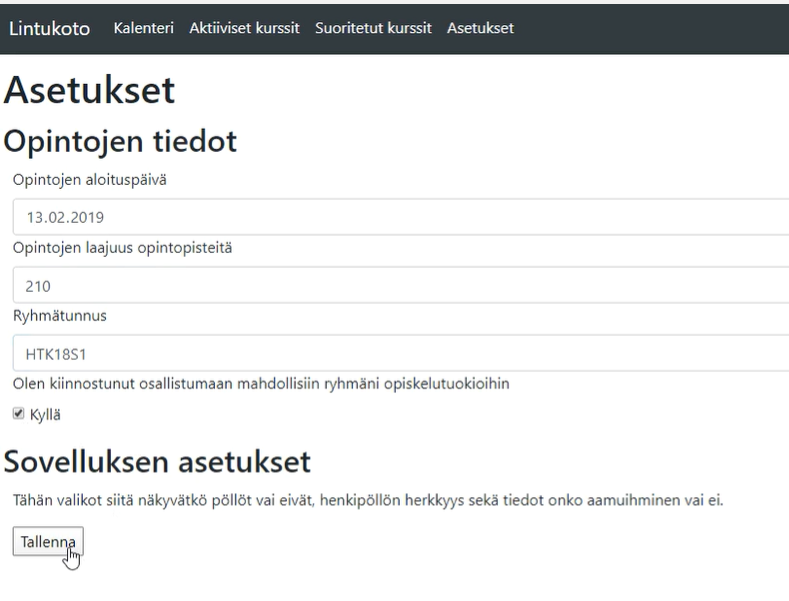
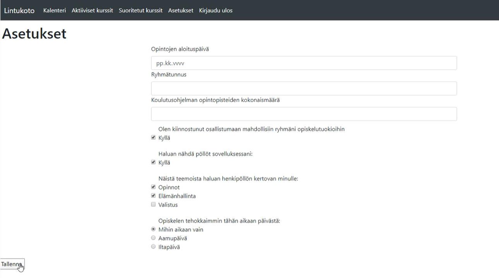
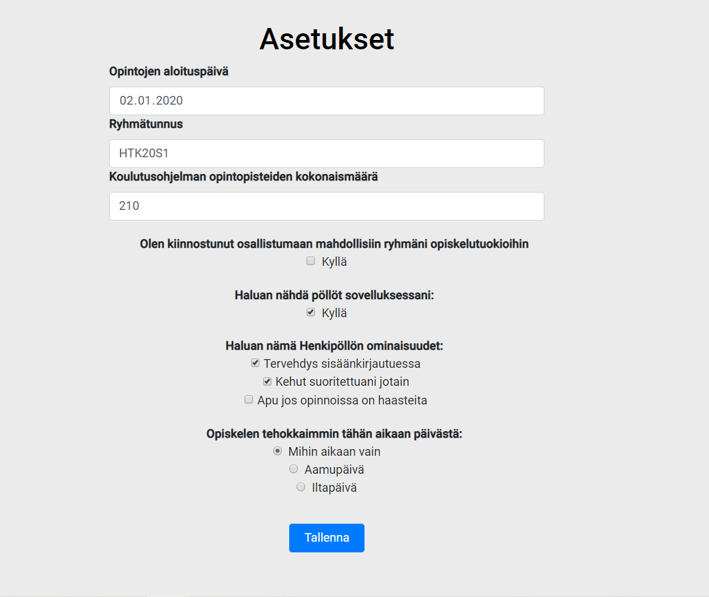
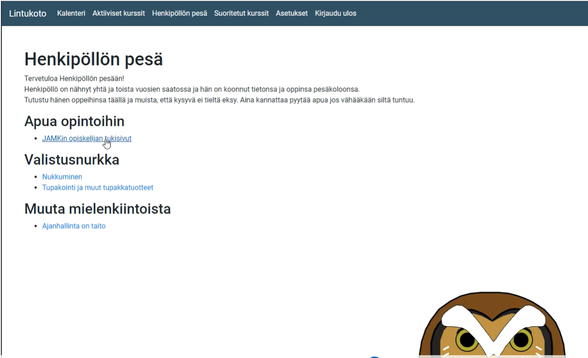
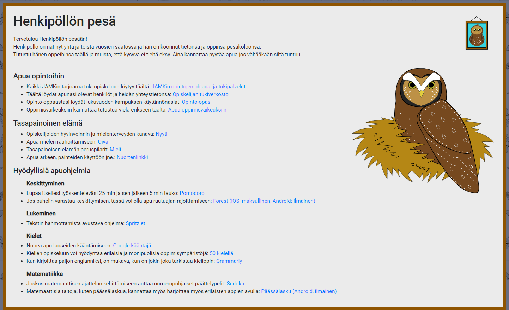
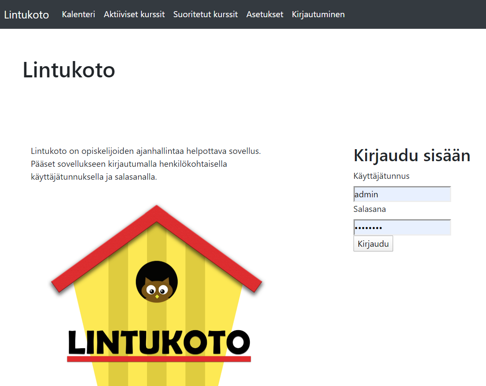
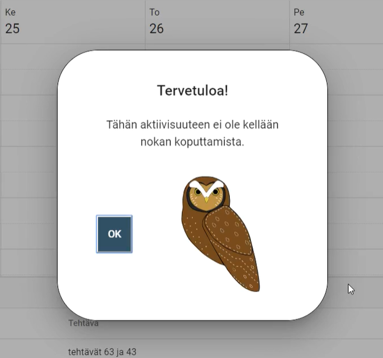

## Sisällysluettelo
  - [Sisällysluettelo](#sis%c3%a4llysluettelo)
  - [Johdanto](#Johdanto)
    - [Asetetut oppimistavoitteet](#Asetetut-oppimistavoitteet)
    - [Toteutunut oppiminen](#Toteutunut-oppiminen)
  - [Tekniset toteutukset](#Tekniset-toteutukset)
    - [Asetukset sivu](#Asetukset-sivu)
      - [Toteutus](#Toteutus)
      - [Haasteet ja oppiminen](#Haasteet-ja-oppiminen)
    - [Henkipöllön pesäsivu](#Henkipöllön-pesäsivu)
      - [Toteutus](#Toteutus)
      - [Haasteet ja oppiminen](#Haasteet-ja-oppiminen)
    - [Alkuperäinen sisäänkirjautuminen](#Alkuperäinen-sisäänkirjautuminen)
      - [Toteutus](#Toteutus)
      - [Haasteet ja oppiminen](#Haasteet-ja-oppiminen)
    - [Henkipöllön kommentointi-ikkuna](#Henkipöllön-kommentointi-ikkuna)
      - [Toteutus](#Toteutus)
      - [Haasteet ja oppiminen](#Haasteet-ja-oppiminen)
  - [Tuoteomistajana toimiminen](#Tuoteomistajana-toimiminen)
  - [Muut aikaansaannokset](#Muut-aikaansaannokset)
  - [Itsearviointi](#Itsearviointi)


## Johdanto

Tämä dokumentti pitää sisällään minun osuuteni Lintukoto-sovelluksen kehittämisestä kevään 2020 Ticorporate Demo Lab-opintojaksolla. 

Dokumentista käy ilmi odotukseni opintojkasolle ja niiden myötä asetetut oppimistavoitteeni. Vertaan niitä siihen mitä lopulta oikeasti opin kevätlukukauden aikana ja missä olisi voinut tehdä toisin. Esittelen myös käytännössä tekemiäni osioita sovelluksesta ja kerron sivutoimistani tuotteenomistajana.

### Asetetut oppimistavoitteet

Vielä kurssin alkaessa olin hyvin epävarma omasta roolistani tiimissä. Puntaroin todella pitkään valitsenko roolin, jossa olen jo kehittynyt (liiketoiminta) vai roolin, jota tuntui etten hahmottanut yhtään (tekniikka). Ohjaajat kuitenkin painottivat, että valitkaa aihe jossa haluatte ensisijaisesti kehittyä. Siksi päätin valita teknisen roolin. Haluaisin joskus vielä työllistyä ohjelmistotuotannon parissa. Myös testaajan rooli kiinnosti minua sivutoimeksi, mutta tiimissämme oli siihen niin paljon halukkaita, että päätin pitäytyä tuoteomistajana roolissa siltä osin.

Olin kyllä käynyt web-sovelluskehitys-kurssia koko syksyn aktiivisesti, mutta sovelluskehityksen maailma ei ollut vielä yhtään avautunut minulle. Tiedän, että opin parhaiten tekemällä, mutta tekemistä helpottaisi jos hahmottaisi isossa kuvassa asioiden merkityksen.
>**Päätin asettaa ensisijaiseksi tavoitteekseni, että sovelluskehityksen maailma alkaisi avautua minulle.**

Näin ymmärtäisin eri asioiden merkityksen ja roolin paremmin. Nollatasolta suunta on kuitenkin vain ylöspäin.

Koska haluan oppia ohjelmoimaan ja mahdollisesti työllistyö sen pariin, oli luonnollista tietysti pyrkiä kehittämään myös niitä kykyjä.
>**Toinen tavoitteeni olikin kehittää ohjelmointitaitoja ihan konkreettisesti, etenkin front-endin osalta.** 

Selkeitä konkreettisia maaleja oli haastava asettaa, koska kokonaiskuvankin hahmottaminen oli vaikeaa. Mutta koska olin päässyt edes tekemään jotain angularilla viime syksynä, uskoin, että siitä minun olisi fiksuinta lähteä syventämään osaamistani. Back-end oli minulle suuri mysteeri, joten sen kohdalla rima oli alempana.

>**Kolmas tavoitteeni oli oppia scrum käytännössä.**

Se on kuitenkin jokin konkreettinen asian jota voi suoraan soveltaa tulevaisuudessa työelämässä. Siksi otin tuoteomistajan roolin mielelläni vastaan. Siitä saa eturivin paikat seurata prosessin pyörittämistä ja olla siihen osallisena. Scrum masterina toimiminen olisi ollut myös vaihtoehto, mutta olin soveltuvin PO-rooliin, joten otin sen siksi ennemmin vastaan.

### Toteutunut oppiminen
Oppimistavoitteeni alkoivat toteutua toteutua pienin askelin.
Ensimmäisenä saavutin ymmärrykseni scrumin prosessien pyörittämisestä. Tein tiivistä yhteistyötä tiimimme scrum masterin kanssa ja sitä kautta scrumin seremoniat kävivät tutuiksi. Otin tarkoituksella vastuuta planningien vetämisestä ZenHubin osalta ja tarvittaessa tuurasin scrum masteria myös dailyen pitämisessä. Saavutin siis kolmannen oppimistavoitteeni hyvin!

Kun teki koodin kanssa paljon töitä viikottain, tarkasti muiden aikaansaannoksia pull requestien osalta ja oppi sitä kautta erilaisien ratkaisuiden käytöstä ja soveltamisesta, huomasin että pikkuhiljaa sovelluskehityksen maailma alkoi avautua minulle. Siihen meni ensimmäiset pari kuukautta. Sitten satuin saamaan kesätöitä alan firmasta Angular-käyttöliittymän kehittäjänä ja se oli selvä merkki minulle, että olen selvästi oppinut jotain olennaista sinä aikana kun olen tätä sovellusprojektia tehnyt. En minä muuten olisi saanut sitä työtä. Työn saaminen myös motivoi minua opiskelemaan Angularia enemmän ja sen jälkeen ymmärrykseni Angularista parani paljon ja sain tehtyä jo hieman haastavampia osia sovellukseen. Tuntui silti, että aika alkoi loppua kesken eikä huhtikuulla ollut enää aikaa tehdä isoja ja monimutkaisia palasia sovellukseen. Kuukaudenkin lisäajalla, olisin saanut varmasti tehtyä enemmän haastavampia osia sovellukseen. Kaiken kaikkiaan, olen selvästi oppinut paljon sovelluskehityksestä ja Angularista. Uskon, että pohjatiedot ovat ihan hyvät kesätyötä varten.

Backend oli minulle pitkään iso mörkö, joten vaikka sovelluksemme backend ei ollutkaan minun vastuullani, opiskelin sitä myös kevään aikana. Halusin etenkin ymmärtää frontin ja backin liitoskohtia paremmin. Pikkuhiljaa tämäkin alkoi seljetä minulle. Ei ehkä ihan niin selkeäksi mitä olin odottanut, mutta sen verta tarpeeksi, että osasin hyödyntää sovelluksemme tietokannasta tietoa frontin puolelle. Ymmärrän siis teoriassa mitä palvelinpuoli ja tietokannat vaativat, vaikka en niitä osaisikaan luoda tällaisen sovelluksen vaatimassa mittakaavassa.


## Tekniset toteutukset
Roolini sovelluksen teknisessä toteutuksessa oli front-endin kehittäjänä. Siksi myös konkreettiset tuotokset ovat kaikki käyttöliittymän kehittämisestä.

### Asetukset sivu

Nimensä mukaan, asetukset sivun tarkoitus on antaa käyttäjälle mahdollisuus lisätä omia henkilökohtaisia toiveita sovelluksen osalta. Kaikille asetukset sivun kohdille oli mietitty vaikutukset sovelluksessa, mutta kaikkia ei ehditty toteuttaa kevään aikana. Asetuksien lomakkeessa on kuitenkin kohdat valmiina, vaikka kaikkien osien takana ei olekaan toiminnallisuuksia.

#### Toteutus

Kokosin alkuun asetukset sivulle lomakkeen, jossa kysyttiin vain opiskelijan perustietoja. Näin saatiin asetukset sivu sovellukseen ja seuraavaksi suunniteltiin paremmin mitä tietoja asetukset sivulle oikeasti halutaan. Ensimmäisessä versiossa ei ollut tiedon validointia eli syötetty tieto sai olla mitä vain. Myöskään muotoiluita ei lisätty tässä vaiheessa.

Asetukset sivun ensimmäinen versio:



Toiseen versioon oli saatu jo koko asetukset-lomake kasaan ja siihen oli lisätty yksinkertaiset muotoilut. Tässä vaiheessa asetuksien tiedot eivät tallentuneet vielä mihinkään, mutta Henri lisäsi tämän jälkeen myös asetuksien tiedot backin puolelle.

Toinen versio:



Viimeisessä vaiheessa huomattiin, että kaikkien kohtien sanamuotoilut eivät sovi siihen mitä sovelluksessa sillä hetkellä tapahtuu, joten lomakkeen tarkoitusta hieman päivitettiin. Nyt asetuksista näki heti konkreettisesti mihin se vaikuttaa sovelluksessa. Tässä vaiheessa lisättiin myös syötetyn tiedon validointeja ja varmistettiin mm. että opintojen aloituspäivä ei voi olla tulevaisuudessa.

Kolmas ja viimeinen versio:



Tässä vielä esimerkki siitä miltä asetuslomakkeen input-kohdat näyttävät aloituspäivämäärän, ryhmätunnuksen ja opintopistemäärän suhteen.

```html
<!--Max-arvo on tällä puolella 2020-05-05 
          mutta ts-tiedoston puolelta siihen syötetään aina current date, joten tästä ei tarvitse välittää-->
        <input
          type="date"
          id="datefield"
          min="1990-01-01"
          max="2020-05-05"
          [(ngModel)]="asetuksetLadattu.asetukset.aloituspaiva"
          name="aloituspaiva"
          class="form-control"
          [value]="asetuksetLadattu.asetukset.aloituspaiva"
        />
      </div>

      <div class="form-group">
        <label class="bold" for="ryhmatunnus">Ryhmätunnus</label><br />
        <input
          type="text"
          [(ngModel)]="asetuksetLadattu.asetukset.ryhmatunnus"
          class="form-control"
          name="ryhmatunnus"
          [placeholder]="asetuksetLadattu.asetukset.ryhmatunnus"
          [value]="asetuksetLadattu.asetukset.ryhmatunnus"
        />
      </div>

      <div class="form-group">
        <label class="bold" for="kokonaisOp"
          >Koulutusohjelman opintopisteiden kokonaismäärä</label
        ><br />
        <input
          type="number"
          min="0"
          max="800"
          [(ngModel)]="asetuksetLadattu.asetukset.kokonaisOp"
          class="form-control"
          name="kokonaisOp"
          [placeholder]="asetuksetLadattu.asetukset.kokonaisOp"
          [value]="asetuksetLadattu.asetukset.kokonaisOp"
        />
      </div>
```

Ja tässä koodi, joka syötetään aloituspäivämäärän max-kohtaan, jotta aloituspäivämäärä ei voi olla tulevaisuudessa.

```javascript
/* Haluttiin varmistaa että opintojen aloituspäivämäärä ei voi olla tulevaisuudessa. 
    Eli se voi olla olla enintään sen hetkinen kuluva päivä*/

    // Kokoaan tämän hetkisen päivän tiedot erikseen
    let today: any = new Date();
    let dd: any = today.getDate();
    // Tammikuu on 0, joten fiksun tulostuksen takia +1
    let mm: any = today.getMonth() + 1;
    let yyyy: any = today.getFullYear();
    if (dd < 10) {
      dd = "0" + dd;
    }
    if (mm < 10) {
      mm = "0" + mm;
    }

    // Koottu päivämäärä viedään lomakkeen max-kohtaan
    today = yyyy + "-" + mm + "-" + dd;
    document.getElementById("datefield").setAttribute("max", today);
  }
  ```

#### Haasteet ja oppiminen

Asetukset sivu oli ensimmäinen koodaamani asia tässä projektissa, joten alkuun se oli hyvä herättely koodin tekemiseen. Oli kuitenkin hyvin opettavaista kun sai myöhemminkin jatkaa asetussivun kehittämistä ja huomata, että kun taidot kehittyy niin sinne osaa lisätä jo tuollaisia "opintojen aloituspäivämäärä ei saa olla tulevaisuudessa"-korjailuja. Se oli myös ensimmäisi bugi-korjauksia joita sain tehtyä ja olin siitä ylpeä. 

Ihan täysin datan validointia ei saanut kuntoon. Vaikka opintopistemäärällä oli min ja max arvot, ne eivät estäneet käyttäjää kirjoittamasta liian isoja tai pieniä arvoja kenttään. Syötekentän sivussa olevista nuolista ei saanut klikkailtua arvoa liian isoksi tai pieneksi, mutta koska arvon voi myös kirjoittaa väärin, korjaus ei ole hirveän hyvä. Tällaisiin olisin halunnut vielä paneutua, mutta aikaa ei ollut lopulta siihen perehtymiseen.

***

### Henkipöllön pesäsivu

Henkipöllön pesäsivulle on koottu opiskelijalle hyödyllisiä linkkejä. Sivun sisältö koottiin yhteistyöhön opinto-ohjaajan kanssa. Tästä syystä sivun sisältö ja rakenne muuttuivat selvästi alkuperäisestä. Sovelluksessa haluttiin, ottaa huomioon asiakkaan toiveet erityisesti tässä kohden. Olimme kuitenkin määritelleen, että koulut ja heidän viralliset opiskelijoita tukevat tahonsa olivat asiakkaitamme, vaikka opiskelija ovatkin käyttäjiämme.

#### Toteutus

Tämä on yksinkertainen staattinen html-sivu joka oli nopea tehdä. Koodillisesti tässä ei ole mitään monimutkaista, koska html oli ennestään tuttua ja hallussa.





Ainoa käytännön syistä lisätty ominaisuus oli, että kun linkkiä painaa, sen takaa avautuva sivu avautuu aina omaan välilehteensä. Alla on esimerkki yhdestä linkkilistan osasta. 
```html
<li> Kaikki JAMKin tarjoama tuki opiskeluun löytyy täältä: 
            <a
              href="https://opinto-oppaat.jamk.fi/fi/opinto-opas-amk/opintojen-tueksi/opintojen-ohjaus/"
              target="_blank"
              >JAMKin  opintojen ohjaus- ja tukipalvelut</a
            >
          </li>
```

#### Haasteet ja oppiminen

Kuten mainittu, ohjelmoinnin osalta tämä ei ollut hirveän monimutkainen sivu. Halusin ottaa tämän mukaan portfoliooni, koska koen oppineeni tätä tehdessä millaista olisi käydä neuvotteluja asiakkaan kanssa niin että asiakas saa sovellukseen sen mitä on tilannut. Keskustelu opinto-ohjaajan kanssa oli hyvä ja siinä oppi heidän ohjaustyöstään paljon sekä sai itse soveltaa kuulemaan omaan sovellukseen. Kun opinto-ohjaaja kertoi esimerkiksi kuinka muissa sovelluksissa on joitain opiskelijoita tukevia elementtejä, ehdotin että noita hyödyllisiä sovelluksia ja sivuja linkataan Henkipöllön pesäsivulle. Ne olivat kuitenkin tukisovelluksia jotka eivät kilpaile meidän sovelluksemme kanssa ja tekisivät Lintukoto-sovelluksestamme entistä käyttäjälähtöisemmän. Pystyisimme paremmin lunastamaan lupauksen siitä, että sovellus välittää myös siitä kuinka hänen käyttäjänsä jaksaa.

***

### Alkuperäinen sisäänkirjautuminen



Koska sovellus on jokaisella käyttäjällä henkilökohtainen, tarvitaan mahdollisuus kirjautua sisään. Ennen kuin käyttäjätunnuksia oli ja tietokantaan oli saatu rakenteet kuntoon, piti luoda tällainen väliaikainen sisäänkirjautuminen. 

Samalla luotiin sovellukseen auth guard, jotta sovelluksen muille sivuille ei pääse ilman, että on kirjautunut sisään.

#### Toteutus
 
Alkuun tarvittiin vain väliaikainen sisäänkirjautuminen, jonka voi myöhemmin korvata kunhan saadaan useampia käyttäjätunnuksia suoraan tietokannasta. Tästä syystä tein ihan yksinkertainen "admin"-tunnuksen. Tällöin sovelluksessa ei ollut vielä yhteyttä tietokantaan, joten tässä vaiheessa projektia hyödynnettiin in-memory-web-api'a.

Sisäänkirjautuminen oli yksinkertainen sisäänkirjautumislomake.

**kirjautuminen.html**
```html
<div class="tekstit">
  <h1 class="otsikko">Lintukoto</h1>
  <p>
    Lintukoto on opiskelijoiden ajanhallintaa helpottava sovellus.<br />
    Pääset sovellukseen kirjautumalla henkilökohtaisella käyttäjätunnuksella ja
    salasanalla.
  </p>
  <div class="kuva">
    
  </div>
</div>

<!--Sisäänkirjautumisen lomake-->
  <div class="login">
    <h2 class="login-header">Kirjaudu</h2>
    <form [formGroup]="loginForm" class="login-container" (ngSubmit)="onSubmit(loginForm.value)">
      <label>Käyttäjätunnus</label><br /> <input type="text" name="username" formControlName = username /><br />
      <label>Salasana</label><br /> <input type="password" name="password" formControlName = password /><br />
      <button type="submit">Lähetä</button>
    </form>
  </div>
```

Komponentin ts-tiedostossa otettiin lomakkeen tiedot vastaan ja annettiin käyttäjälle tieto onnistuiko sisäänkirjautuminen, mutta varsinalliset toiminnallisuudet olivat serviceillä.

**kirjautuminen.ts**
```javascript
constructor(private FormBuilder: FormBuilder, private AuthService: AuthService) {
    this.loginForm = this.FormBuilder.group( {username: '', password: ''} );
  }

  onSubmit(loginData) {
    console.log(loginData);
    if (loginData.username === this.cred[0].username && loginData.password === this.cred[0].password) {
      this.AuthService.login();
    } else {
      alert('Väärä tunnus tai salasana!');
    }
  }

  ngOnInit() {
    this.AuthService.getData().subscribe((data: any []) => {
      this.cred = data;
    });
  }
}
```

Servicejä oli kaksi. Ensimmäisessä oli määritelty väliaikaiset käyttäjätunnukset, johon kirjautumiskomponentin ts-tiedosto vertaa lomakkeelle annettuja käyttäjätietoja.

**User service**
```javascript
export class UserService implements InMemoryDbService {

  constructor() { }

  createDb() {
  const user = [
    { id: 1, username: 'admin', password: 'password' }
  ];
  return {user};
  }
}
```

Toinen oli auth-service, jossa oli kirjautumisen kannalta olennaiset toiminnot eli sisään- ja uloskirjautumiset. Jos kirjautuminen oli ok, service päästi käyttäjän etusivulle eli kalenteri-sivulle. Jos käyttäjä kirjautuu ulos, service vie käyttäjän takaisin kirjautumissivulle.

**Auth service**
```javascript
export class AuthService {
  private cred;
  credUrl: 'http://localhost:80/api'; // oikeasti tulisi apin osoite
  loggedIn = false;

  constructor(private http: HttpClient, private router: Router) { }

  getData() {
    return this.http.get('http://localhost:80/api/user');
  }

  login() {
    if (this.loggedIn === false) {
      this.loggedIn = true;
      this.router.navigate(['/kalenteri']);
    }
  }

  logout() {
    this.loggedIn = false;
    this.router.navigate(['/kirjautuminen']);
    alert('Olet kirjautunut ulos');
  }
}
```

Koska ei haluttu, että käyttäjä pääsee näkemään muita sivuja vasta kirjauduttuaan sisään, loin myös sovellukselle perusmuodon auth guardista.

**Auth guard**
```javascript
constructor(private authService: AuthService, private router: Router) {}

  canActivate(
    next: ActivatedRouteSnapshot,
    state: RouterStateSnapshot): Observable<boolean | UrlTree> | Promise<boolean | UrlTree> | boolean | UrlTree {
    const url: string = state.url;
    return this.checkLogin(url);
  }
  checkLogin(url: string): boolean {
    if (this.authService.loggedIn) {
      return true;
    }
    this.router.navigate(['/kalenteri']);
    return false;
  }
}
```

Tämä huomioitiin lopuksi routing modulessa, lisäämällä sen hetkisiin reitteihin AuthGuard.
```javascript
const routes: Routes = [
  // canActivate: [AuthGuard] varmistaa että on kirjauduttu sisään, ennen kuin päästään muualle sovelluksessa
  { path: "kalenteri", component: KalenteriComponent, canActivate: [AuthGuard] },
  { path: "aktiiviset", component: AktiivisetKurssitComponent, canActivate: [AuthGuard] },
  { path: "suoritetut", component: SuoritetutKurssitComponent, canActivate: [AuthGuard] },
  { path: "asetukset", component: AsetuksetComponent, canActivate: [AuthGuard] },
  { path: "kirjautuminen", component: KirjautuminenComponent },
  { path: "", component: KirjautuminenComponent },
];
```

#### Haasteet ja oppiminen

Sisäänkirjautumisen luomisessa aloin kunnolla hahmottaa serviceiden roolia Angularissa. Tässä sain tehdä niitä kaksi ja molempien roolien ymmärtäminen avasi kyllä ymmärtämistä serviceihin isommassa mittakaavassa.

Myös auth guardin roolin ymmärtäminen parani tätä tehdessä. Auth guard suojaa tietoja jottei niihin pääsisi muut, kuin sisäänkirjautunut käyttäjä, käsiksi. Tiesin tämän kyllä teorian osalta, mutta en käytännössä. 

Tämäkin oli melko aikaisessa vaiheessa kurssia, joten haasteena oli kyky soveltaa aiemmin opittua tähän sovellukseen. On ihan eri asia tehdä kurssitehtävä jossa on pelkästään sisäänkirjaus ja komponentti. Tässä meillä oli jo useampi komponentti joten kesti hetki hahmottaa mihin väliin jo olemassa olevaa koodia, tämä olisi fiksua laittaa niin etten riko muuta. Onnistuin siinä kuitenkin parin yrityksen jälkeen. Välillä meni vähän ristiin mitä pitää importata minnekäkin ja ottaa käyttöön, mutta kyllä se kokeilemalla alkoi seljetä.

***

### Henkipöllön kommentointi-ikkuna



Henkipöllön kommentointi-ikkuna ilmestyy kun käyttäjä kirjautuu sisälle ja kun tämä saa kurssitehtävän tehtyä. Sisäänkirjautumisen osalta toiminnon saa kytkettyä pois asetuksista.

#### Toteutus

Perusteet tälle löytyi [Angular Material-sivulta](https://material.angular.io/components/dialog/overview).
Henkipöllön kommentointi-ikkunalle on luotu oma componentti, jossa Henkipöllön mahdollisista kommenteista arvotaan jokin lause avautuvaan dialogi-ikkunaan.

**dialog.ts**
```javascript
// Taulukko, jossa on kaikki tervehdysvaihtoehdot sisäänkirjautuessa
  tervehdykset = [
    "Olet tehnyt upeasti hommia viime aikoina, hyvää työtä!",
    "Olet ollut mestari ajankäyttäjä. Jatka samaan malliin!",
    "Olen seurannut sinun ahkeraa työskentelyäsi. Osaat hyvin!",
    "Et ole yhtään pöllömpi tyyppi! (◉Θ◉)",
    "Kiva, että tulit taas! Sinua on aina kiva nähdä!",
    "Olet taitava! Olen sinusta ylpeä!",
    "Et taida olla eilisen teeren poikia.",
    "Hienoa katsella, kun joku osaa.",
    "Sinulla on homma hallussa! Ja vaikka ei olisikaan, otat homman kyllä aina lopulta haltuun!",
    "Tähän aktiivisuuteen ei ole kellään nokan koputtamista."
  ];
  
  //arpoo randomilla yhden kehun aiemmin luodusta taulukosta
  randomTervehdys() {
    this.valittuTervehdys = this.tervehdykset[
      Math.floor(Math.random() * this.tervehdykset.length)
    ];
  }
```
Tämä lause viedään html-sivulle yhdessä Henkipöllön kuvan kanssa.

**dialog.html**
```html
<div class="mat-dialog-content">
  <div class="otsikko">
    <h1 class="mat-dialog-title">Tervetuloa!</h1>
    <p>
      {{ valittuTervehdys }}
    </p>
  </div>
  <!-- <div class="tekstit">
  </div> -->
  <div class="nappi">
    <button class="mat-button" mat-dialog-close>OK</button>
  </div>
  <div class="kuva">
    
  </div>
</div>
```

Seuraavaksi valittiin kohta sovelluksesta josta halutaan kommentti-ikkunan avautuvan. Sovelluksessa näitä kohtia olivat sisäänkirjautumisen yhteydessä ja kun sai tehtävän suoritettua. 

Sisään kirjautumisen yhteydessä piti myös huomioida, ettei ikkuna saa aueta jos tunnus tai salasana ovat väärin. Eli vain onnistuneen kirjautumisen jälkeen, ikkuna sai avautua.

Tarkoitus oli, että asetuksista sai valita, haluaako kommentti-ikkunan avautuvan vai ei. Tämä ominaisuus ehdittiin tehdä sisäänkirjautumisen yhteyteen. Jos asetuksien chackbox on rastitettu, ikkuna avautuu, jos ei niin ikkunakaan ei ilmesty sisäänkirjautumisen yhteydessä.

**kirjautuminen.ts**
```typescript
this.userService.login(this.loginData).subscribe(
      (res: any) => {
        localStorage.setItem("token", res.token);
        localStorage.setItem("user", this.loginData.tunnus);
        this.router.navigate(["/kalenteri"]);
        // hakee asetuksista tiedon, haluaanko käyttäjä nähdä Henkipöllön tervehdyksen sisään kirjautuessa
        this.http.get(
          "henkipolloOpinnot",
          this.dialogiasetukset.asetusLadattu.henkipolloOpinnot
        );
        // Jos käyttäjä on raksinut asetuksista ruudun jossa sallitaan tervehdys, kutsutaan tervehdyksen käynnitävä metodi
        if (this.dialogiasetukset.asetusLadattu.henkipolloOpinnot == true) {
          this.popup();
        }
      },
      err => {
        alert("Invalid username or password");
      }
    );
    this.AuthService.login();
  }

  // Avaa sisäänkirjautuessa Henkipöllön tervehdyksen popup-ikkunan
  popup() {
    this.dialog.open(DialogComponent);
  }
```

#### Haasteet ja oppiminen
Tämä oli varmasti monimutkaisin kokonaisuus jonka sain tehtyä. Onneksi sen sai tehdä palasissa, että ensin toimiva dialogi-ikkuna ja sitten opeteltiin miten ja mihin kohti koodia se kannattaa laittaa. Huomasin tässä vaiheessa kevättä, että hahmotuskykyni koodin lukemiselle oli kehittynyt. Eli ymmärsin pääpiirteittäin muiden tekemää koodia vaikka en ole ollut sitä itse tekemässä. 

Kokonaisuus vaati lopulta jo ymmärrystä frontin ja backin yhdistämisestä, jonka maailma oli vasta aukenemassa minulle. Sain selvittää kuinka hyödyntää kannassa olevia asetustietoja ja niiden tietojen tarkastuksen jälkeen ikkuna joko avautui tai ei. Tämä oli hyvä ja konkreettinen esimerkki siitä, että vaikka en ole koodannut backiä, sen ymmärtäminen on kriittinen askel kehittyä myös frontti-koodarina. Opin tässä paljon.

## Tuoteomistajana toimiminen
Lintukoto-sovelluksesta kehiteltiin joulukuussa 2019 alustava konsepti, jossa toimin pääideoijana ja suunnittelijana. Tästä syystä minulle oli luonteva rooli ottaa tuoteomistajan eli product ownerin (PO jatkossa) rooli. Tämä rooli oli sivutoimeni kevään 2020 aikana.

PO:na otin vastuun ZehHub ja GitHub työkalumme käyttöönotosta ja ylläpidosta. Niiden osalta työnkuvaani kuului:
* ZenHubin ja GitHubin rakenteen hahmottelu projektia varten
  * Epicien ja UserStrorien kirjoittamisen päävastuu 
  * Sovelluksen eri haarojen (branch) luonti ja käyttöönoton varmistaminen
* Vastuu siitä että GitHubia ja ZenHubia käytetän oikein ja tehokkaasti
  * Järjestää tarvittaessa koulutuksia ohjaajilta koko tiimille
  * Huolehtia siitä että tiimi sopii yhdessä yhteiset koodauskäytänteet ja pitäytyy niissä
* Priorisoida product backlog niin, että ylimpänä listassa on aina tärkeimmät työt sovelluksen kehittymisen kannalta
* Bugikorjauskäytänteiden tuominen ZenHubiin, jotta kuka tahansa voi tehdä bugikorjailuja ja nähdä mitä bugeja muu tiimi työstää
* Pull requestien tarkastaminen ja hyväksyminen yhdessä päätestaajan kanssa

Muut PO-toimet joita kevään aikana hoidin:
* Projektisuunnitelman ja Esitutkimuksen visio-osuuksien kirjoittaminen ja tarvittaessa päivittäminen
* Alussa sovelluksen sisällön ja ulkoasukuvauksen kouluttaminen tiimille
* Bugipalaveri testaajien kanssa bugien priorisoinnista ja määristä
* Esitysmateriaalien kasaaminen ja esittäminen (demot ja liiketoimintasuunnitelma)
* Keskustelut opinto-ohjaajan kanssa, jotta sovellus kehittyisi myös opiskelija tuen kannalta oikeaan suuntaan


## Muut aikaansaannokset

* [Sovelluksen visuaalisen ulkonäön suunnittelu ja päivittäminen](https://jamkstudent-my.sharepoint.com/:w:/g/personal/m2936_student_jamk_fi/EXnRKCvpEd1OtMOr3yjOFBYBf720on2HdmNHYsQrv0cayg?e=MQmYyj)
 * Järjestää palautekeskusteluja ja äänestyksiä ulkoasusta tiimin ulkopuolisten henkilöiden kanssa
* [Liiketoimintasuunnitelman esitysmateriaalit](https://jamkstudent-my.sharepoint.com/:p:/g/personal/m2936_student_jamk_fi/EUvZ9TMCYqtJhHDpyegLaNcB_UtlJJ0N4xBFkNVfnMtSvw?e=v70rov)
* [Sovelluksen kehittymisen tallentaminen videomateriaaleihin joka sprintin päätteeksi](https://jamkstudent-my.sharepoint.com/:f:/g/personal/m2936_student_jamk_fi/Eho25sOL17RGpsTXLsySCJMBFpXYJQcySCNihfif7jxGWg?e=WpaRh0)
* [Demoesitysmateriaalien kasaaminen ja esittäminen demoon 1](https://jamkstudent-my.sharepoint.com/:p:/g/personal/m2936_student_jamk_fi/EY3kYf9rKwZBrkIxHETegA0BulTRuRZ2FO_SNjR9og-aIg?e=2KQPBm)
* [Demoesitysmateriaalien kasaaminen ja esittäminen demoon 2](https://jamkstudent-my.sharepoint.com/:p:/g/personal/m2936_student_jamk_fi/EeM52B7zfy5AoBX6hmTWt4cBSmiVt3QSZM7RASylZq1ZhQ?e=QJKEk2)
* [Mock up kurssitiedot ja kursseille tehtävät](https://jamkstudent-my.sharepoint.com/:w:/g/personal/m2936_student_jamk_fi/EXWVtOJTJr1Fkj-5na9JDUEBLtzj8ONln5wIYodPhkVTgQ?e=91GFnJ)
* Tutustuminen sähköisiin allekirjoitustapoihin projektisopimuksen kannalta
* Markkinointivideossa avustaminen

## Itsearviointi
